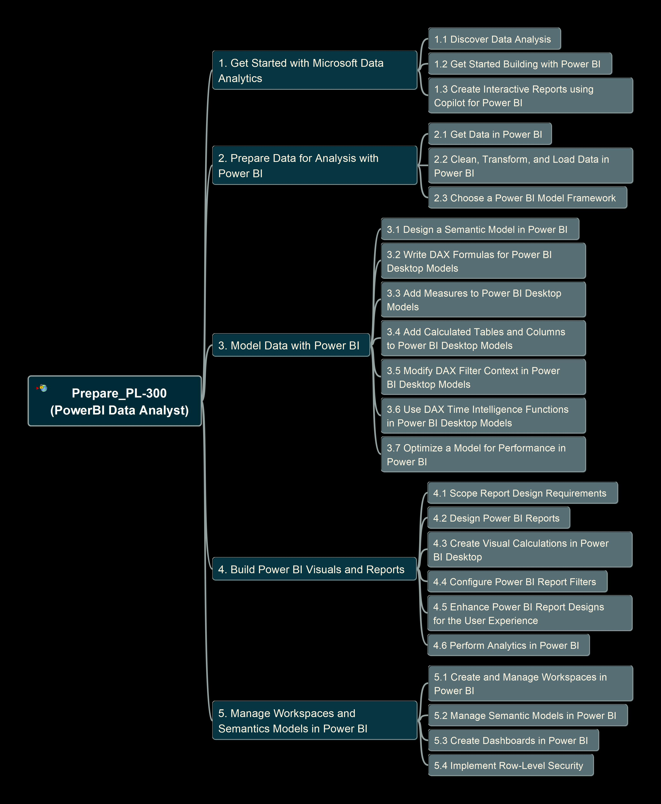

# Prepare PL-300 base on Microsoft Learn

PL-300 is the exam for gain Microsoft Certified Power BI Data Analyst Associate, I'd gotten this certification in 2021 and keep refreshing it in past 4 years. This page (course) aims to go through the [content in Microsoft Learn](https://learn.microsoft.com/en-us/credentials/certifications/data-analyst-associate/?practice-assessment-type=certification) site and demo to you the detail knowledge points, supporting you to prepare and pass the exam.

## Structure (MindMap) of the Learning Contents

## Demo Material

The demo videos will be preapre and shared in following site soon:

- YouTube: Edited Videos
- Udemy: Packaged Course

Keep checking here on the progress, stay tunes.

And, may you good luck for getting this certification!